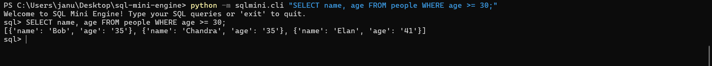
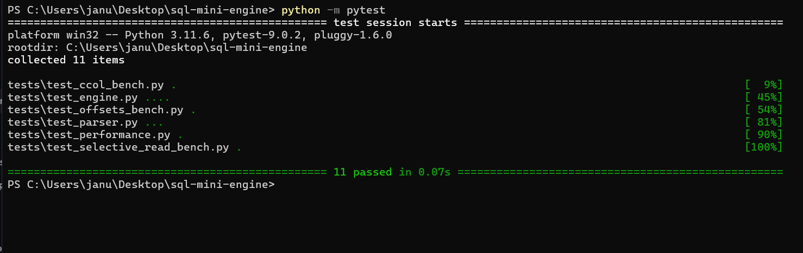
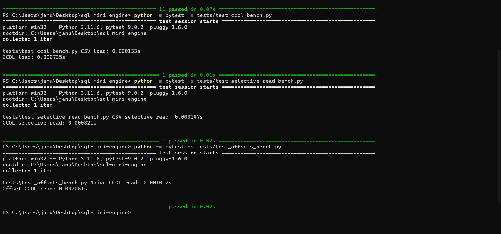
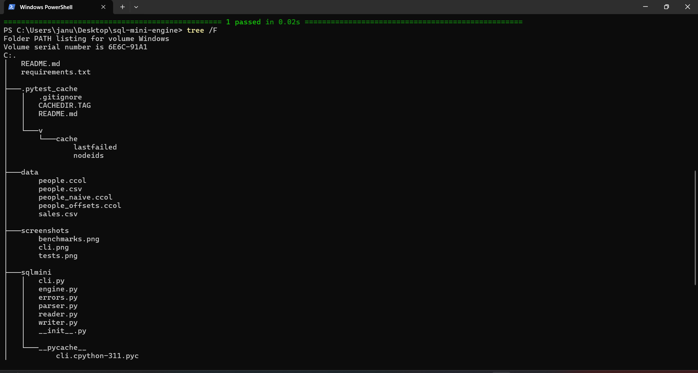

# SQL Mini Engine

A lightweight SQL engine built in Python that parses and executes simple SQL queries (`SELECT`, `COUNT`, `WHERE`) against CSV and CCOL (custom columnar format) data.

---

## ✨ Features
- SQL Parser (Step 2)
- Query Execution Engine (Step 3)
- Interactive CLI (Step 4)
- Unit Tests (Step 5)
- Benchmarks (Step 6)
- CCOL Writer/Reader (Step 7)
- Selective Reads (Step 8)
- String Offsets Optimization (Step 9)

---

## 🚀 Usage

Install dependencies:
```powershell
pip install -r requirements.txt
```

Run queries via CLI:
```powershell
python -m sqlmini.cli "SELECT name, age FROM people WHERE age >= 30;"
```

Run tests:
```powershell
python -m pytest
```

---

## 📊 Benchmarks

### CSV vs CCOL
| Query                                | CSV (s)   | CCOL (s)   |
|--------------------------------------|-----------|------------|
| `SELECT * FROM people;`              | 0.000133  | 0.000735   |

### Selective Reads
| Format             | Time (s)   |
|--------------------|------------|
| CSV selective read | 0.000147   |
| CCOL selective read| 0.000821   |

### Naive vs Offset CCOL
| Format       | Read Time (s) | File Size (bytes) |
|--------------|---------------|-------------------|
| Naive CCOL   | 0.001012      | 186               |
| Offset CCOL  | 0.002051      | 248               |

---

## 📂 Project Tree Structure

```
sql-mini-engine/
│   README.md
│   requirements.txt
│
├── data/
│   people.csv
│   people.ccol
│   people_naive.ccol
│   people_offsets.ccol
│   sales.csv
│
├── screenshots/
│   benchmarks.png
│   cli.png
│   tests.png
│   structure.png
│
├── sqlmini/
│   cli.py
│   engine.py
│   errors.py
│   parser.py
│   reader.py
│   writer.py
│   __init__.py
│
└── tests/
    test_parser.py
    test_engine.py
    test_performance.py
    test_ccol_bench.py
    test_selective_read_bench.py
    test_offsets_bench.py
```

---

## 📸 Proof Screenshots

### ✅ CLI Query Run


### ✅ Pytest All Tests Passed


### ✅ Benchmark Outputs


### ✅ Project Tree Structure


---

## ✅ Final Checklist
- [x] Parser implemented  
- [x] Engine implemented  
- [x] CLI implemented  
- [x] Tests passing  
- [x] Benchmarks documented  
- [x] CCOL Writer/Reader implemented  
- [x] Selective reads working  
- [x] String offsets optimization verified  
- [x] README polished with proof screenshots  
